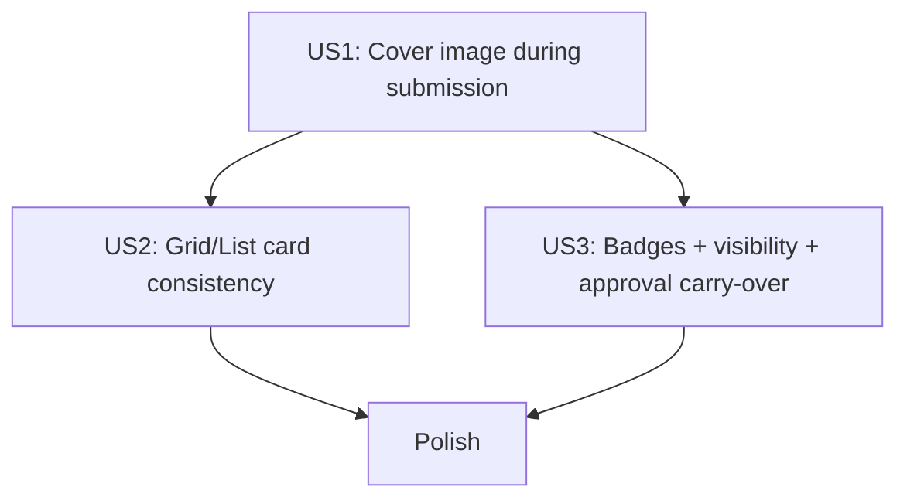

---

description: "Task list for feature implementation"
---

# Tasks: Resource Submission Cover Images

**Input**: Design documents from `/specs/011-resource-cover-image/`
**Prerequisites**: plan.md (required), spec.md (required for user stories), research.md, data-model.md, contracts/, quickstart.md

**Tests**: Included because this feature changes API behavior, permissions, and persistence (per constitution quality gates).

**Organization**: Tasks are grouped by user story to enable independent implementation and testing of each story.

## Format: `[ID] [P?] [Story] Description`

- **[P]**: Can run in parallel (different files, no dependencies)
- **[Story]**: Which user story this task belongs to (e.g., [US1], [US2], [US3])
- Each task includes exact file paths

---

## Phase 1: Setup (Shared Infrastructure)

**Purpose**: Minimal project wiring and config to support the feature.

- [X] T001 Add submission image storage settings in backend/app/core/config.py
- [X] T002 Ensure Docker volume mount persists submission images in docker-compose.yml
- [X] T003 [P] Add/confirm submission cover image i18n strings in frontend/src/i18n/locales/en.json
- [X] T004 [P] Add/confirm submission cover image i18n strings in frontend/src/i18n/locales/zh.json

---

## Phase 2: Foundational (Blocking Prerequisites)

**Purpose**: Backend schema + endpoints + generated client updates that all user stories depend on.

**Independent Test**: A logged-in user can (a) create a submission with `image_external_url`, (b) upload a submission cover image, (c) fetch `image_url` from API, and (d) load the versioned `/submission-images/...` URL.

- [X] T005 Extend ResourceSubmission image columns in backend/app/models.py
- [X] T006 Create Alembic migration for submission image columns (autogenerate; commit the new file under backend/app/alembic/versions/)
- [X] T007 [P] Add submission image save/delete helpers in backend/app/utils.py
- [X] T008 [P] Add submission image serving router in backend/app/api/routes/submission_images.py
- [X] T009 Wire submission image serving router in backend/app/api/main.py
- [X] T010 Add `image_external_url` to submission create/update schemas in backend/app/models.py
- [X] T011 Add computed `image_url` to submission public schema in backend/app/models.py
- [X] T012 Refactor submission response builder to include `image_url` in backend/app/api/routes/submissions.py
- [X] T013 Validate + persist `image_external_url` with mutual exclusivity in backend/app/api/routes/submissions.py
- [X] T014 Add upload/replace endpoint in backend/app/api/routes/submissions.py (`POST /submissions/{id}/image-upload`)
- [X] T015 Add clear endpoint in backend/app/api/routes/submissions.py (`DELETE /submissions/{id}/image`)
- [X] T016 Regenerate frontend OpenAPI client using scripts/generate-client.sh (after all contract-affecting backend changes)
- [X] T017 [P] Add API tests for submission image upload/clear + `image_url` in backend/tests/api/routes/test_submissions.py, including negative validation cases:
  - rejects unsupported content types
  - rejects files over 5MB
  - rejects images smaller than 32x32
  - rejects images with input dimension over 4096
  - rejects invalid external URLs (non-http/https or missing host)
- [X] T018 [P] Add API tests for immutable serving URL in backend/tests/api/routes/test_submission_images.py

**Checkpoint**: Backend returns `image_url` and serves uploaded submission images.

---

## Phase 3: User Story 1 — Add a cover image on submission (Priority: P1) 🎯 MVP

**Goal**: Users can set a submission cover image via upload or external URL during the submission flow.

**Independent Test**: Submit a new resource with (a) an external image URL and (b) an uploaded file, and confirm the submission’s `image_url` is set and mutually exclusive.

- [X] T019 [P] [US1] Create submission cover image field component in frontend/src/components/Submissions/SubmissionCoverImageField.tsx
- [X] T020 [US1] Wire cover image fields into create flow in frontend/src/routes/_layout/submissions/new.tsx
- [X] T021 [P] [US1] Add client-side validation helpers (file size/type + URL scheme/host) in frontend/src/utils.ts
- [ ] T022 [P] [US1] Add/adjust Playwright test for submission creation with external image URL in frontend/tests/submissions-cover-image.spec.ts

**Checkpoint**: New submission page supports cover image (upload or URL), with clear mutual exclusivity.

---

## Phase 4: User Story 2 — Resource cards stay consistent in grid and list views (Priority: P2)

**Goal**: My submissions render with the same cover-image area rules as Resources in both grid and list views.

**Independent Test**: Create two submissions (with image and without), switch between grid/list, and confirm consistent layout + graceful fallback on image load error.

- [X] T023 [P] [US2] Create grid card for submissions using resource card patterns (cover image slot/fallback + status badge) in frontend/src/components/Submissions/SubmissionGridCard.tsx
- [X] T024 [P] [US2] Create table view for submissions using resource table patterns (cover image slot/fallback + status badge) in frontend/src/components/Submissions/SubmissionsTable.tsx
- [X] T025 [P] [US2] Export submission components in frontend/src/components/Submissions/index.ts
- [X] T026 [US2] Update submissions listing to use "my submissions" + grid/list toggle in frontend/src/routes/_layout/submissions/index.tsx
- [ ] T027 [P] [US2] Add/adjust Playwright coverage for grid/list rendering + fallback behavior + status badges in frontend/tests/submissions-list-views.spec.ts

**Checkpoint**: Submissions page matches Resources page UX for grid/list and image slot/fallback, and renders status badges in both views.

---

## Phase 5: User Story 3 — Status badges appear consistently (Priority: P3)

**Goal**: Users only see their own submissions (all statuses) and can reliably interpret status badges; approvals carry cover images to published Resources.

**Independent Test**: (1) Non-admin cannot browse pending submissions via admin list endpoint. (2) Approving a submission produces a published Resource with the same cover image.

- [X] T028 [US3] Restrict admin submissions list to admins only in backend/app/api/routes/submissions.py (GET /submissions)
- [X] T029 [US3] Carry over submission cover image on approval in backend/app/api/routes/submissions.py
- [X] T030 [P] [US3] Add tests for admin-only listing permissions in backend/tests/api/routes/test_submissions.py
- [X] T031 [P] [US3] Add tests for approval carry-over (uploaded + external) in backend/tests/api/routes/test_submission_review.py
- [X] T032 [US3] Verify OpenAPI did not change for permission/behavior-only updates; regenerate client only if the schema changed (scripts/generate-client.sh)

**Checkpoint**: Visibility rules match spec; approval carry-over works end-to-end.

---

## Phase 6: Polish & Cross-Cutting Concerns

**Purpose**: Final consistency passes, docs alignment, and quickstart validation.

- [X] T033 [P] Run backend lint/typecheck gates with backend/scripts/lint.sh
- [X] T034 [P] Run backend tests with backend/scripts/tests-start.sh
- [X] T035 [P] Run frontend lint/build with frontend/package.json scripts (`npm run lint`, `npm run build`)
- [X] T036 Validate end-to-end flows from specs/011-resource-cover-image/quickstart.md

---

## Dependencies & Execution Order

**Client generation note**: T016 is the primary OpenAPI client regeneration step (run after the final contract-affecting backend change). T032 is a guardrail step for late permission/behavior changes: regenerate only if OpenAPI schema actually changed.

### Phase Dependencies

- **Setup (Phase 1)**: No dependencies
- **Foundational (Phase 2)**: Depends on Setup; blocks all user stories
- **US1 (Phase 3)**: Depends on Foundational
- **US2 (Phase 4)**: Depends on Foundational; can proceed after or alongside US1 once APIs exist
- **US3 (Phase 5)**: Depends on Foundational; approval carry-over depends on image fields/endpoints
- **Polish (Phase 6)**: Depends on all desired user stories

### User Story Dependency Graph

---

## Parallel Execution Examples

### US1 Parallelizable Work

- T019 (component) and T021 (validation helpers) can be done in parallel

### US2 Parallelizable Work

- T023 (grid card) and T024 (table view) can be done in parallel

### US3 Parallelizable Work

- T030 (permissions tests) and T031 (approval carry-over tests) can be done in parallel

---

## Implementation Strategy

### MVP First (US1 Only)

1. Complete Phase 1–2
2. Complete Phase 3 (US1)
3. Validate with the US1 independent test + specs/011-resource-cover-image/quickstart.md

### Incremental Delivery

1. Add US2 (grid/list consistency)
2. Add US3 (permissions + approval carry-over)
3. Finish Polish phase gates
